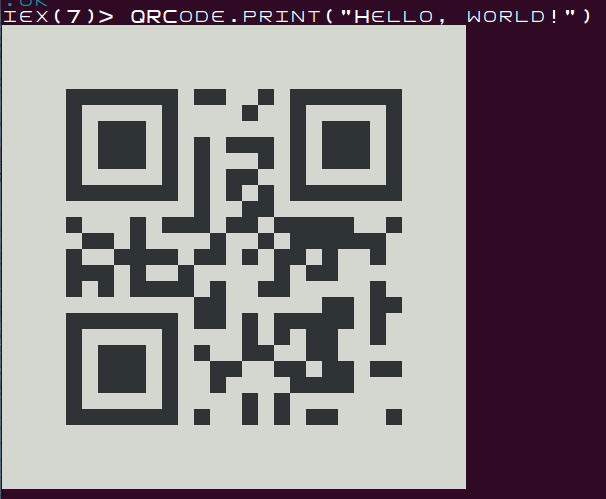

# QRCode

Based on Erlang version: https://github.com/komone/qrcode/

QRCode is a library for Elixir to create byte-mode QR codes.

## Usage

Encode new QR code

    iex> QRCode.encode "Hello, world!"
    %QRCode{
      data: <<0, 0, 0, 0, 0, 0, 0, 0, 0, 0, 0, 0, 0, 0, 0, 254, 203, 248, 4, 16,
        144, 64, 46, 128, 186, 1, 117, 117, 208, 11, 168, 174, 128, 65, 89, 4, 3,
        250, 175, 224, 0, 19, 0, 0, 139, 183, 200, 3, 66, ...>>,
      dimension: 29,
      ecc: 'M',
      version: 1
    }

Encode and return as a string of # and .

    iex> QRCode.as_string("Hello, world!") |> IO.puts
    .............................
    .............................
    .............................
    .............................
    ....#######.##..#.#######....
    ....#.....#....#..#.....#....
    ....#.###.#.......#.###.#....
    ....#.###.#.#.###.#.###.#....
    ....#.###.#.#...#.#.###.#....
    ....#.....#.#.##..#.....#....
    ....#######.#.#.#.#######....
    ............#..##............
    ....#...#.###.##.#####..#....
    .....##.#....#..#.######.....
    ....#..####.##.#.##.#..#.....
    ....###.#..#.....#.##........
    ....#.#.####.#..##.....#.....
    ............##......##.##....
    ....#######.##.#.#####.#.....
    ....#.....#....#.#.##..#.....
    ....#.###.#.#..##..##........
    ....#.###.#..##..##.##.##....
    ....#.###.#..#....####.......
    ....#.....#....#.#...........
    ....#######.#..#.#.##...#....
    .............................
    .............................
    .............................
    .............................

Encode and display in terminal

